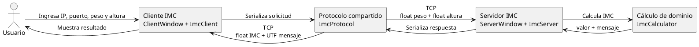

# Corrección de una aplicación distribuida para calcular el IMC

## Resumen

Este proyecto implementa una aplicación distribuida cliente-servidor para calcular el índice de masa corporal mediante sockets TCP y Java Swing. El punto de partida fue la guía de la actividad, en la que se describe un servidor que recibe el peso y la altura, realiza el cálculo y devuelve una respuesta a la aplicación cliente [1].

La solución se divide en una capa de dominio, una capa de comunicación, un servidor TCP y un cliente TCP. Durante la revisión se corrigieron problemas relacionados con la validación de entradas, la atención de clientes, la concurrencia, el cierre de recursos y la actualización de la interfaz gráfica.

## Objetivo

El objetivo es iniciar un servidor en un puerto TCP, conectar uno o varios clientes, transmitir dos datos numéricos por solicitud y devolver el IMC junto con un mensaje de clasificación. El programa también debe controlar entradas incorrectas y desconexiones sin cerrarse de forma inesperada.

## Herramientas utilizadas

| Herramienta | Uso en el proyecto |
|---|---|
| JDK de Java | Compilar y ejecutar las clases Java. |
| NetBeans | Abrir, editar, organizar y ejecutar el proyecto. |
| Java Swing | Construir las ventanas del servidor y del cliente. |
| Sockets TCP | Intercambiar información entre los dos programas. |
| Google Docs | Consultar la guía y revisar el diseño de la actividad. |
| Code Blocks | Consultar los fragmentos de código con formato legible. |
| PlantUML Gizmo | Representar el flujo de la comunicación. |
| Git y GitHub | Guardar las distintas versiones del proyecto. |

## Arquitectura

La clase `ImcCalculator` valida los valores y calcula el resultado. `ImcProtocol` define el formato de intercambio: la solicitud contiene dos valores `float`, peso y altura; la respuesta contiene un `float` con el IMC y un texto `UTF` con el mensaje. `ImcServer` acepta conexiones y atiende cada cliente en un hilo independiente. `ImcClient` mantiene la conexión y envía las solicitudes desde la interfaz gráfica.

La ventana del servidor permite configurar el puerto, iniciar o detener el servicio y consultar el log. La ventana del cliente permite introducir la dirección, el puerto, el peso y la altura. Las operaciones de red se ejecutan en segundo plano para que las ventanas continúen respondiendo.

## Errores corregidos

La condición original para validar el puerto no garantizaba que el valor fuera válido. La nueva versión comprueba que el puerto esté entre 1 y 65535 antes de abrir el servidor.

La atención de clientes utilizaba una llamada recursiva después de enviar cada respuesta. Se reemplazó por un ciclo controlado que permite realizar varios cálculos durante una misma conexión.

También se corrigió el manejo del estado del cliente. Antes de calcular, se verifica que exista una conexión activa. Los campos se validan antes de convertirlos a números y aceptan tanto el punto como la coma decimal.

El conjunto de sockets activos se maneja con una estructura concurrente y cada conexión se cierra de manera segura. La ventana del servidor actualiza el log mediante `SwingUtilities.invokeLater`, mientras que el cliente utiliza `SwingWorker` para no bloquear el hilo de eventos de Swing.

## Verificación

La verificación incluye una prueba del cálculo y una prueba de integración TCP. La primera cubre un IMC saludable, peso cero, valores no finitos y formato con dos decimales. La segunda inicia un servidor real, conecta un cliente, realiza dos solicitudes en la misma conexión y comprueba las respuestas recibidas.

El comando `./scripts/test.sh` compila el proyecto y ejecuta ambas pruebas. El detalle de los resultados está en [`resultado-pruebas.md`](resultado-pruebas.md). La compilación utiliza `javac --release 8`, de acuerdo con la versión de referencia de la guía.

## Conclusiones

La aplicación mantiene el objetivo original de la actividad y mejora su funcionamiento en situaciones habituales de error. La separación entre cálculo, protocolo, servidor, cliente e interfaz facilita la comprensión del programa y permite probar cada parte de forma independiente.

La versión actual permite iniciar el servidor, conectar el cliente, realizar varios cálculos y mostrar mensajes claros cuando los datos no son válidos. Las instrucciones de uso se encuentran en el archivo `README.md`.

## Referencias

[1]: https://drive.google.com/file/d/1wAzLY8teIHK3styt5L9xbCEtzoVoeXT0/view "Guía para desarrollar aplicaciones distribuidas usando Java Socket TCP/IP"
